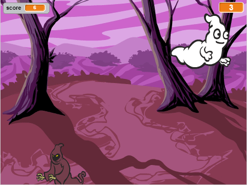

--- no-print ---

This is the **Scratch 2** version of the project. There is also a [Scratch 3 version of the project](https://projects.raspberrypi.org/ar-SA/projects/ghostbusters).

--- /no-print ---

## المقدمة

سوف تقوم بصنع لعبة إصطياد أشباح!

### ما الذي ستصنعه

--- no-print ---

--- /no-print ---

--- print-only ---

--- /print-only ---

--- collapse ---
---
title: ما ستحتاج إليه
---
### الأجهزة

+ جهاز حاسب آلي

### البرمجيات

+ برنامج Scratch 2.0 (سواء أكان [عبر الإنترنت](http://rpf.io/scratchon){:target="_blank"} أو [دون اتصال بالإنترنت](http://rpf.io/scratchoff){:target="_blank"})

--- /collapse ---

--- collapse ---
---
title: ما الذي ستتعلمه
---
يتناول هذا المشروع عناصر من معايير المناهج الرقمية الخاصة بـ [Raspberry Pi](http://rpf.io/curriculum){:target="_blank"}:

+ [استخدم أدوات البرمجة الأساسية لإنشاء برامج بسيطة.](https://www.raspberrypi.org/curriculum/programming/creator)

--- /collapse ---

--- no-print ---

إذا كنت بحاجة إلى طباعة هذا المشروع، فيُرجى استخدام [النسخة القابلة للطباعة](https://projects.raspberrypi.org/ar-SA/projects/ghostbusters-scratch2/print).

--- /no-print ---
