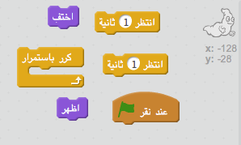
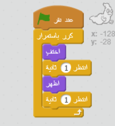

## تحريك شبح

--- task ---

افتح مشروع Scratch جديدًا وفارغًا.

[[[generic-scratch-new-project]]]

--- /task ---

--- task ---

أضف كائن شبح جديدًا وخلفية مناسبة.

[[[generic-scratch-sprite-from-library]]]

[[[generic-scratch-backdrop-from-library]]]

--- /task ---

--- task ---

أضف تعليمة برمجية إلى الشبح بحيث يظهر ويختفي تمامًا باستمرار عندما تنقر فوق العلم.

--- hints --- --- hint --- بمجرد `النقر فوق العلم الأخضر`{:class=”blockcontrol”}، ستحتاج إلى `إخفاء` الشبح {:class=”blocklooks”} لمدة `ثانية واحدة`{:class=”blockcontrol”} ثم `تظهره`{:class=”blocklooks”} لمدة` ثانية واحدة`{:class=”blockcontrol”}. ستحتاج إلى القيام بهذا `للأبد`{:class=”blockcontrol”}. --- /hint --- --- hint --- فيما يلي التعليمات البرمجية التي ستحتاج إلى استخدامها:  --- /hint --- --- hint --- يجب أن تكون التعليمة البرمجية التي تُدخلها كما يلي:  --- /hint --- --- /hints ---

--- /task ---

--- task ---

إختبر واحفظ المشروع الخاص بك.

[[[generic-scratch-saving]]]

--- /task ---
