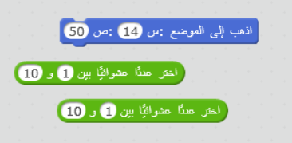
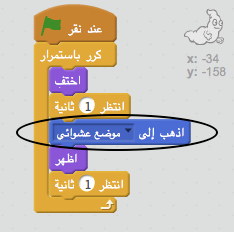
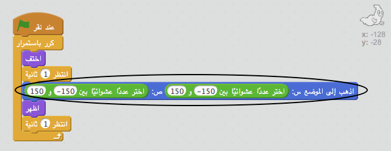

## أشباح عشوائية

في الوقت الراهن، من السهل جدًا اصطياد الشبح الخاص بك لأنه لا يتحرك!

--- task ---

هل يمكنك إضافة تعليمة برمجية إلى الشبح بحيث يظهر في مواقع عشوائية على الشاشة بدلًا من البقاء في الموقع نفسه؟

--- hints --- --- hint --- تحتاج إلى برمجة الشبح باستخدام `انتقل إلى`{:class=”blockmotion”} موقع عشوائي على المنصة قبل كل مرة يظهر فيها. --- /hint --- --- hint --- توجد مجموعتان من القوالب البرمجية التي يمكنك استخدامها. هذا القالب:  أو هذا القالب:  ---/hint --- --- hint --- يجب أن تبدو التعليمات البرمجية الخاصة بك إما مثل هذا:  أو يمكن أن تبدو كالتالي:  --- /hint --- --- /hints ---

--- /task ---

--- challenge ---

## التحدي: أكثر عشوائية

هل يمكنك برمجة الشبح باستخدام `انتظر`{:class=”blockcontrol”} لمدة عشوائية من الوقت قبل الظهور؟ وهل يمكنك استخدام القالب `عيِّن الحجم`{:class=”blocklooks”} لتجعل الشبح يظهر في كل مرة بحجم عشوائي؟ --- /challenge ---
