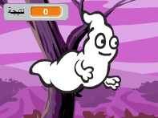
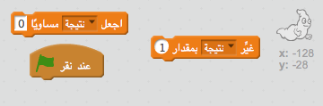
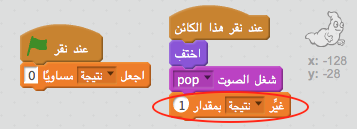

## إضافة نتيجة

لنجعل اللعبة أكثر تشويقًا بتسجيل النقاط!

--- task ---

أنشئ متغيرًا جديدًا يُسمى 'النتيجة'.

[[[generic-scratch-add-variable]]]

--- /task ---

--- task ---

هل يمكنك تسجيل نقاط اللاعب؟ يجب أن يتمكن اللاعبون من إحراز النقاط بالنقر فوق الأشباح لاصطيادها.

في كل مرة ينقر فيها اللاعب على الشبح، يجب ان تزيد عدد النقاط.

--- hints --- --- hint --- `عندما يتم النقر على العلم الأخضر`{:class=”blockevents”}، متغير `النتيجة`{:class=”blockdata”} يجب أن يكون `مساوي 0`{:class=”blockdata”}. المنصة هي أفضل مكان لإضافة هذه التعليمة البرمجية. `عندما يتم النقر على كائن الشبح`{:class=”blockevents”}، `النتيجة`{:class=”blockdata”} يجب أن`تتغير بمقدار 1`{:class=”blockdata”}. --- /hint --- --- hint --- فيما يلي التعليمات البرمجية التي ستقوم باستخدامها:  --- /hint --- --- hint --- إليك التعليمات البرمجية لكيفية تسجيل النقاط:  --- /hint --- --- /hints ---

--- /task ---
