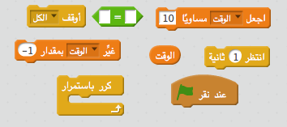
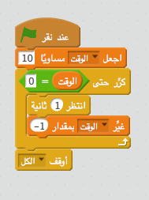
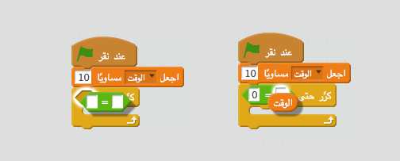

## إضافة مؤقِت

--- task ---

أنشئ متغيرًا جديدًا يُسمى 'الوقت'.

--- /task ---

--- task ---

هل يمكنك إضافة موقِّت إلى المنصة لتمنح اللاعب 10 ثوان فقط لاصطياد أكبر عدد ممكن من الأشباح؟

يجب برمجة الموقِت على النحو التالي:

+ يبدأ العد من 10 ثوان
+ يبدأ في العد التنازلي بمقدار ثانية واحدة

ستنتهي اللعبة عندما يصل الموقِت إلى 0.

--- hints --- --- hint --- `عندما يتم النقر على العلم الأخضر`{:class=”blockevents”}، متغير `الوقت`{:class=”blockdata”} يجب أن يكون `مساوي 10`{:class=”blockdata”}. بعد ذالك يجب `تغيير الوقت بمقدار -1`{:class=”blockdata”} كل ثانية `حتى تصل إلى 0`{:class=”blockcontrol"}. --- /hint --- --- hint --- فيما يلي التعليمات البرمجية التي ستقوم بإستخدامها:  --- /hint --- --- hint --- إليك كيفية إضافة المؤقت إلى لعبتك: 

وهذه كيفية إنشاء قالب `الوقت = 0`:  --- /hint --- --- /hints ---

--- /task ---

--- task ---

اطلب من صديق أن يجرِّب اللعبة. كم عدد النقاط التي يمكنه إحرازها؟

---/task--

إذا كانت اللعبة سهلة للغاية، فيمكنك:

+ منح اللاعب وقتًا أقل
+ اجعل ظهور الأشباح أقل
+ تصغير أحجام الأشباح

--- task ---

غيِّر قيم المتغيرات واختبر اللعبة عدة مرات حتى تصل إلى مستوى الصعوبة الذي تريده.

--- /task ---
