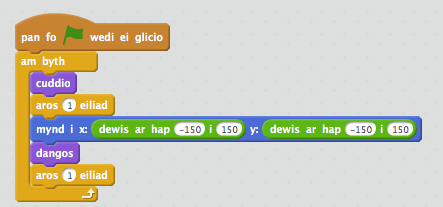

## Ysbrydion ar hap

Mae dy ysbryd yn hawdd iawn i'w ddal, gan nad yw e'n symud!

+ Yn lle aros yn yr un man, mae modd i ti adael i Scratch ddewis cyfesurynnau ar hap yn lle.  Ychwanega bloc `mynd i`{:class="blockmotion"} i gôd yr ysbryd, fel ei fod yn edrych fel hyn:

	

+ Profa'r ysbryd eto, ac fe ddylse ti sylwi ei fod yn ymddangos mewn lle gwahanol bob tro.

--- challenge ---
## Her: Mwy o ddigwyddiadau ar hap
Wyt ti'n gallu gwneud i dy ysbryd `aros`{:class="blockcontrol"} amser ar hap cyn ymddangos? Wyt ti'n gallu defnyddio y bloc `gosod maint`{:class="blockcontrol"} i wneud i dy ysbryd fod yn faint ar hap bob tro mae'n ymddangos?
--- /challenge ---
