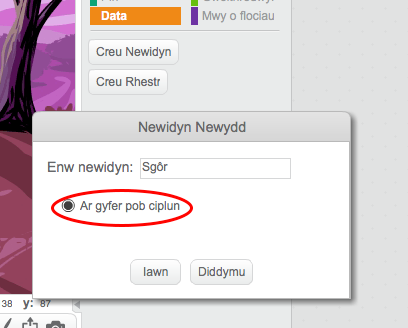
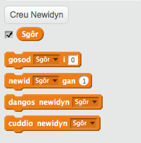
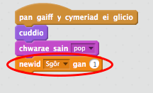

## Ychwanegu sgôr 

Beth am wneud pethau yn fwy diddorol trwy gadw sgôr.

+ I gadw sgôr y chwareuwr, mae angen lle i'w roi e. Mae _newidyn_ yn fan i gadw data sydd yn newid, fel sgôr.

	I greu newidyn newydd, clicia ar y tab 'Sgriptiau', dewisa `Data`{:class="blockdata"} yna clica 'Creu Newidyn'

	

	Teipia 'Sgôr' fel enw y newidyn, gan wneud yn siwr ei fod ar gael ar gyfer pob ciplun, a clicia 'Iawn' i'w greu.  Fyddi di yn gweld llawer o flociau côd mae modd defnyddio gyda dy newidyn `sgôr`{:class="blockdata"}.

	

	Byddi di hefyd yn gweld y sgôr ar ochr top chwith y llwyfan.

	

+ Pan mae gêm newydd yn dechrau (wrth glicio'r faner), fe ddylse ti osod sgôr y chwareuwr i 0:

	
	
+ Pryd bynnag mae ysbryd yn cael ei ddal, mae angen i ti ychwanegu 1 i sgôr y chwareuwr:

	

+ Rheda dy raglen eto i ddal rhai ysbrydion.  Ydy dy sgôr yn newid?
