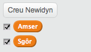
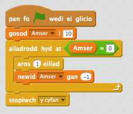
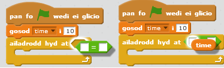
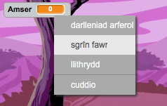

## Ychwanegu amserydd

Rwyt ti'n gallu gwneud y gêm yn fwy diddorol, wrth roi 10 eiliad i dy chwareuwr i ddal cymaint o ysbrydion ag sy'n bosib.

+ Rwyt ti'n gallu defnyddio amrywiad arall i arbed yr amser sydd yn weddill. Clicia ar y llwyfan a chreu amrywiad newydd o'r enw 'amser':

	

+ Dyma sut ddylai'r amserydd weithio:

	+ Fe ddylai'r amserydd ddechrau ar 10 eiliad; 
	+ Fe ddylai'r amserydd gyfrif lawr bob eiliad; 
	+ Fe ddylai'r gêm ddod i ben pan mae'r amserydd yn cyrraedd 0.

	Dyma'r côd i wneud hyn, mae modd ychwanegu hwn i'r __llwyfan__:

	

	Dyma sut rwyt ti'n ychwanegu y côd `ail-adrodd tan`{:class="blockcontrol"} `amser`{:class="blockdata"} `=0`{:class="blockoperators"}:

	

+ Llusga y newidyn 'amser' i ochr dde y llwyfan.  Rwyt ti hefyd yn gallu defnyddio clic-dde ar y newidyn a dewis 'sgrin fawr' i newid sut mae'r amser yn cael ei ddangos.

	

+ Gofyna i ffrind brofi dy gêm.  Faint o bwyntiau mae nhw'n gallu sgorio? Os mae dy gêm di yn rhy hawdd, mae modd i ti:

	+ Rhoi llai o amser i'r chwareuwr;
	+ Gwneud i'r ysbryd ymddangos yn llai aml;
	+ Gwneud yr ysbryd yn llai.

	Profa dy gêm nifer o weithiau nes dy fod yn hapus ei fod y lefel cywir o anodd.
