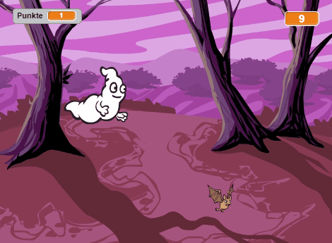

--- no-print ---

This is the **Scratch 2** version of the project. There is also a [Scratch 3 version of the project](https://projects.raspberrypi.org/de-DE/projects/ghostbusters).

--- /no-print ---

## Einleitung

Du wirst ein Gespensterjagd-Spiel machen!

### Was du machen wirst

--- no-print ---

--- /no-print ---

--- print-only ---

--- /print-only ---

--- collapse ---
---
title: Was du brauchen wirst
---
### Hardware

+ Einen Computer

### Software

+ Scratch 2.0 (entweder [online](http://rpf.io/scratchon){:target="_blank"} oder [offline](http://rpf.io/scratchoff){:target="_blank"})

--- /collapse ---

--- collapse ---
---
title: Was du lernen wirst
---
Dieses Projekt umfasst Elemente aus den folgenden Teilen des [ Raspberry Pi Digital Making Curriculum ](http://rpf.io/curriculum){:target="_blank"}:

+ [Verwendung grundlegender Programmierkonstrukte, um einfache Programme zu erstellen.](https://www.raspberrypi.org/curriculum/programming/creator)

--- /collapse ---

--- no-print ---

Falls du dieses Projekt ausdrucken musst, verwende bitte die [druckfreundliche Version](https://projects.raspberrypi.org/de-DE/projects/ghostbusters-scratch2/print).

--- /no-print ---