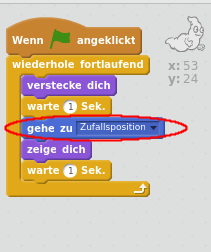

## Zufällige Orte

Dein Gespenst ist im Moment wirklich leicht zu fangen, weil es sich nicht bewegt!

--- task ---

Kannst du dein Gespenst so programmieren, dass es an zufälligen Positionen auf dem Bildschirm erscheint, anstatt an ein und derselben Stelle zu bleiben?

--- hints --- --- hint --- Bringe dein Gespenst dazu, vor jedem Erscheinen zu einer zufälligen Position auf der Bühne `zu gehen`{:class=”blockmotion”}. --- /hint --- --- hint --- Es gibt zwei Sätze von Code-Blöcken, die du verwenden kannst. Diesen:  Oder diesen:  --- /hint --- --- hint --- Dein Code sollte entweder so aussehen:  Oder er könnte so aussehen:  --- /hint --- --- /hints ---

--- /task ---

--- challenge ---

## Herausforderung: Mehr Zufälligkeit

Kannst du dein Gespenst eine zufällige Zeit `warten`{:class=”blockcontrol”} lassen, bevor es erscheint? Kannst du dem Gespenst mit dem `setzte Größe auf:`{:class=”blocklooks”}-Block vor jedem Erscheinen eine zufällige Größe geben? --- /challenge ---