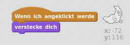

## Gespenster fangen

Nun wollen wir es dem Spieler ermöglichen, Gespenster zu fangen!

--- task ---

Kannst du dein Gespenst verschwinden lassen, wenn es gefangen wurde?

Du solltest auf die Geister klicken können, um sie zu fangen. Wenn dir das Fangen zu schwierig erscheint, kannst du das Spiel im Vollbildmodus spielen, indem du auf diese Schaltfläche klickst:

--- hints --- --- hint --- `Wenn sie angeklickt wird`{:class=”blockevents”}, sollte sich die Geisterfigur `verstecken`{:class=”blocklooks”}. --- /hint --- --- hint --- Dein Code sollte so aussehen:  --- /hint --- --- /hints ---

--- /task ---

--- challenge ---

## Herausforderung: Einen Klang dazugeben

Kannst du deinen Geist dazu bringen, jedes Mal ein Geräusch zu machen, wenn er gefangen wird? --- /challenge ---