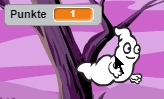
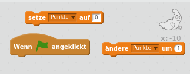
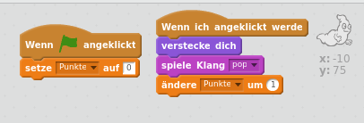

## Eine Punktzahl hinzufügen

Lass uns die Dinge interessanter machen, indem wir Punkte zählen!

--- task ---

Erstelle eine neue Variable namens "Punkte".

[[[generic-scratch-add-variable]]]

--- /task ---

--- task ---

Kannst du den Punktestand des Spielers mitschreiben? Die Spieler sollten Punkte bekommen, wenn sie auf Gespenster klicken, um sie zu fangen.

Jedes Mal, wenn ein Spieler auf ein Gespenst klickt, sollte sein Punktestand erhöht werden.

--- hints --- --- hint --- `Wenn die grüne Flagge angeklickt wird`{:class=”blockevents”}, sollte die Variable `Punkte`{:class=”blockdata”} `auf 0 gesetzt`{:class=”blockdata”} werden. Am Besten ist dieser Code bei Bühne aufgehoben. `Wenn die Gespenst-Figur angeklickt wird`{:class=”blockevents”}, sollte sich der Wert der Variable `Punkte`{:class=”blockdata”} um `1 erhöhen`{:class=”blockdata”}. --- /hint --- --- hint --- Hier sind die Code-Blöcke, die Du brauchen wirst:  --- /hint --- --- hint --- So sammelt man Punkte wenn man auf Geister klickt:  --- /hint --- --- /hints ---

--- /task ---