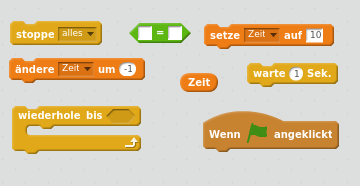
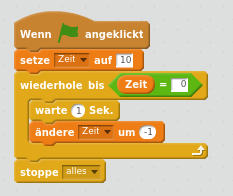
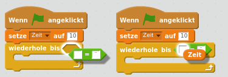

## Hinzufügen eines Timers

--- task ---

Erstelle eine neue Variable und nenne sie "Zeit".

--- /task ---

--- task ---

Kannst du deiner Bühne einen Timer hinzufügen, so dass dein Spieler nur 10 Sekunden hat, um so viele Geister wie möglich zu fangen?

Dein Timer sollte:

+ bei 10 Sekunden beginnen
+ Jede Sekunde herunterzählen

Das Spiel soll enden, wenn der Timer auf 0 steht.

--- hints --- --- hint --- `Wenn die grüne Flagge angeklickt wird`{:class=”blockevents”}, sollte die `Zeit`{:class=”blockdata”}-Variable `auf 10 gesetzt`{:class=”blockdata”} werden. Sie sollte dann jede Sekunde `um -1 geändert werden`{:class=”blockdata”} bis sie `den Wert 0 erreicht`{:class=”blockcontrol"}. --- /hint --- --- hint --- Hier sind die Code-Blöcke, die du brauchen wirst:  --- /hint --- --- hint --- So fügst du deinem Spiel den Timer hinzu: 

Und so machst du den `Zeit = 0` Block:  --- /hint --- --- /hints ---

--- /task ---

--- task ---

Bitte eine/n Freund/in, dein Spiel zu testen. Wie viele Punkte schafft er/sie?

--- /task ---

Wenn dein Spiel zu einfach ist, kannst du:

+ dem Spieler weniger Zeit geben
+ die Gespenster weniger oft erscheinen lassen
+ die Gespenster kleiner machen

--- task ---

Verändere und teste dein Spiel ein paar Mal, bis du mit dem Schwierigkeitsgrad zufrieden bist.

--- /task ---