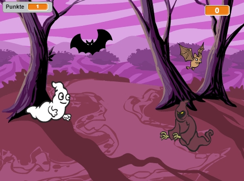

## Herausforderung: mehr Objekte

Kannst du deinem Spiel andere Objekte hinzufügen?

Wenn du ein Objekt hinzufügst, musst du über folgende Dinge nachdenken.

+ Wie groß ist es?
+ Wird es öfter als der Geist erscheinen, oder seltener?
+ Wie wird es aussehen / klingen, wenn es gefangen wurde?
+ Wie viele Punkte erhält (oder verliert) der Spieler, wenn er es fängt?

Wenn du Hilfe beim Hinzufügen eines zusätzlichen Objekts benötigst, kannst du einfach erneut durch die vorher genannten Schritte gehen!
***
### Von der Community übersetzt

Dieses Projekt wurde von Anastasia Heilmann/Karl Schuh übersetzt und von Thorsten Billib/Helmut Schlimper überprüft.

Unsere großartigen Freiwilligen helfen uns, Kindern auf der ganzen Welt die Möglichkeit zu geben, coden zu lernen. Sie können uns helfen, mehr Kinder zu erreichen, indem Sie unsere Projekte übersetzen - lesen Sie mehr unter [rpf.io/translators](https://rpf.io/translators).