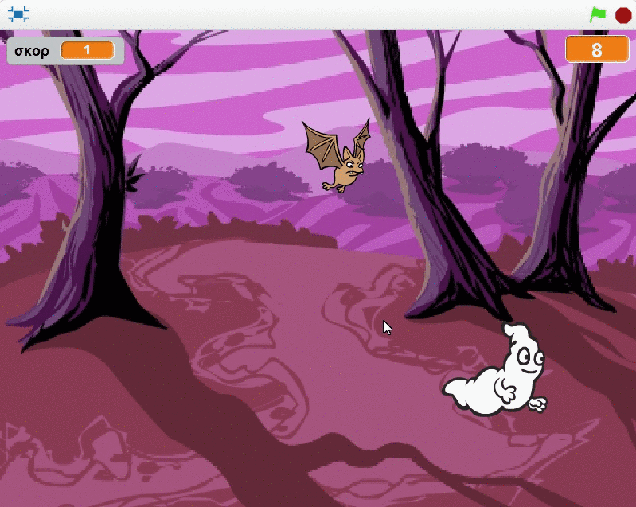
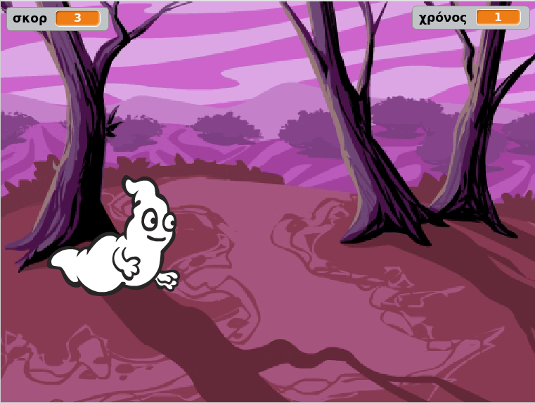

--- no-print ---

This is the **Scratch 2** version of the project. There is also a [Scratch 3 version of the project](https://projects.raspberrypi.org/el-GR/projects/ghostbusters).

--- /no-print ---

## Εισαγωγή

Πρόκειται να φτιάξεις ένα παιχνίδι για κυνήγι φαντασμάτων!

### Τι θα κάνεις

--- no-print ---

--- /no-print ---

--- print-only ---

--- /print-only ---

--- collapse ---
---
title: Τι θα χρειαστείς
---
### Υλικό

+ Υπολογιστής

### Λογισμικό

+ Scratch 2.0 (είτε [online](http://rpf.io/scratchon){:target="_blank"} είτε [offline](http://rpf.io/scratchoff){:target="_blank"})

--- /collapse ---

--- collapse ---
---
title: Τι θα μάθεις
---
Αυτό το έργο περιλαμβάνει στοιχεία από το παρακάτω μάθημα του [Raspberry Pi Digital Curriculum Making](http://rpf.io/curriculum){:target="_blank"}:

+ [Χρησιμοποίησε βασικές δομές προγραμματισμού για να δημιουργήσεις απλά προγράμματα.](https://www.raspberrypi.org/curriculum/programming/creator)

--- /collapse ---

--- no-print ---

Αν χρειαστεί να εκτυπώσεις αυτό το έργο, χρησιμοποίησε την [εκτυπώσιμη έκδοση](https://projects.raspberrypi.org/el-GR/projects/ghostbusters-scratch2/print).

--- /no-print ---