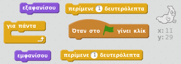
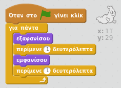

## Σχεδιάζοντας ένα φάντασμα

--- task ---

Άνοιξε ένα νέο έργο στο Scratch.

[[[generic-scratch-new-project]]]

--- /task ---

--- task ---

Πρόσθεσε ένα νέο αντικείμενο-φάντασμα και ένα κατάλληλο σκηνικό.

[[[generic-scratch-sprite-from-library]]]

[[[generic-scratch-backdrop-from-library]]]

--- /task ---

--- task ---

Πρόσθεσε κώδικα στο φάντασμά σου ώστε να εμφανίζεται και να εξαφανίζεται για πάντα όταν κάνεις κλικ στη σημαία.

--- hints --- --- hint --- Μόλις `πατηθεί η πράσινη σημαία`{:class= "blockevents"}, θα πρέπει να `εξαφανίζεται`{:class="blocklooks"} το φάντασμά σου για `ένα δευτερόλεπτο`{:class="blockcontrol"} και στη συνέχεια να `εμφανίζεται`{:class="blocklooks"} για `ένα δευτερόλεπτο`{:class="blockcontrol"}. Θα χρειαστεί αυτό να γίνεται `για πάντα`{:class="blockcontrol"}. --- /hint --- --- hint --- Εδώ είναι τα μπλοκ κώδικα που θα χρειαστείς:  --- /hint --- --- hint --- Έτσι πρέπει να είναι ο κώδικάς σου:  --- /hint --- --- /hints ---

--- /task ---

--- task ---

Δοκίμασε και αποθήκευσε το έργο σου.

[[[generic-scratch-saving]]]

--- /task ---