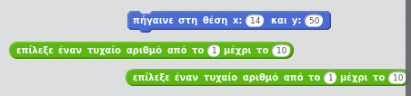
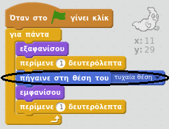
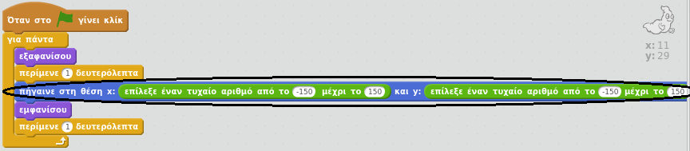

## Τυχαία φαντάσματα

Μέχρι στιγμής, το φάντασμά σου είναι πολύ εύκολο να πιαστεί γιατί δεν κινείται!

--- task ---

Μπορείς να προσθέσεις κώδικα στο φάντασμά σου έτσι ώστε, αντί να μένει στην ίδια θέση, να εμφανίζεται σε τυχαίες θέσεις στην οθόνη;

--- hints --- --- hint --- Tο φάντασμά σου θέλεις να `πηγαίνει σε`{:class="blockmotion"} μια τυχαία θέση στο σκηνικό πριν εμφανιστεί κάθε φορά. --- /hint --- --- hint --- Υπάρχουν δύο ομάδες μπλοκ κώδικα που μπορείς να χρησιμοποιήσεις. Αυτή:  Ή αυτή:  --- /hint --- --- hint --- Ο κώδικάς σου θα πρέπει να φαίνεται ως εξής:  Ή μπορεί να μοιάζει έτσι:  --- /hint --- --- /hints ---

--- /task ---

--- challenge ---

## Πρόκληση: περισσότερη τυχαιότητα

Μπορείς να κάνεις το φάντασμα `να περιμένει`{:class="blockcontrol"} ένα τυχαίο χρονικό διάστημα πριν εμφανιστεί; Μπορείς να χρησιμοποιήσεις το μπλοκ `όρισε το μέγεθος του αντικειμένου`{:class="blocklooks"} για να έχει το φάντασμα τυχαίο μέγεθος κάθε φορά που εμφανίζεται; --- /challenge ---