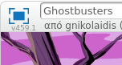
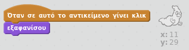

## Πιάνοντας φαντάσματα

Ας επιτρέψουμε στον παίκτη να πιάνει φαντάσματα!

--- task ---

Μπορείς να κάνεις το φάντασμα να εξαφανίζεται όταν πιαστεί;

Θα πρέπει να μπορείς να κάνεις κλικ στα φαντάσματα για να τα πιάσεις. Εάν το βρίσκεις δύσκολο, μπορείς να παίξεις το παιχνίδι σε λειτουργία πλήρους οθόνης κάνοντας κλικ σε αυτό το κουμπί:

--- hints --- --- hint --- `Όταν στο αντικείμενο γίνει κλικ`{:class="blockevents"}, το φάντασμά σου πρέπει να `εξαφανίζεται`{:class="blocklooks"}. --- /hint --- --- hint --- Ο κώδικάς σου θα πρέπει να είναι έτσι:  --- /hint --- --- /hints ---

--- /task ---

--- challenge ---

## Πρόκληση: προσθέτοντας ήχο

Μπορείς να κάνεις το φάντασμα να βγάζει έναν ήχο κάθε φορά που πιάνεται; --- /challenge ---