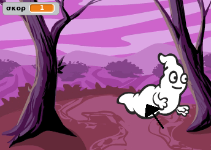
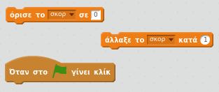
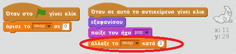

## Προσθήκη βαθμολογίας

Ας κάνουμε τα πράγματα πιο ενδιαφέροντα κρατώντας βαθμολογία!

--- task ---

Δημιούργησε μία νέα μεταβλητή που ονομάζεται 'σκορ'.

[[[generic-scratch-add-variable]]]

--- /task ---

--- task ---

Μπορείς να παρακολουθείς τη βαθμολογία του παίκτη; Οι παίκτες πρέπει να κερδίζουν πόντους όταν πιάνουν φαντάσματα κάνοντας κλικ πάνω τους.

Κάθε φορά που ένας παίκτης κάνει κλικ σε ένα φάντασμα, η βαθμολογία πρέπει να αυξάνεται.

--- hints --- --- hint --- `Όταν πατηθεί η πράσινη σημαία`{:class="blockevents"}, η μεταβλητή σου `σκορ`{:class="blockdata"} πρέπει να `οριστεί σε 0`{:class="blockdata"}. Το Σκηνικό (Stage) είναι το καλύτερο μέρος για να προσθέσεις αυτόν τον κώδικα. `Κάθε φορά που στο φάντασμα γίνει κλικ`{:class="blockevents"}, η μεταβλητή σου `σκορ`{:class="blockdata"} πρέπει να `αυξάνεται κατά 1`{:class="blockdata"}. --- /hint --- --- hint --- Εδώ είναι τα μπλοκ κώδικα που θα χρειαστείς:  --- /hint --- --- hint --- Να πως κερδίζεις πόντους κάνοντας κλικ στα φαντάσματα:  --- /hint --- --- /hints ---

--- /task ---