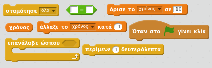
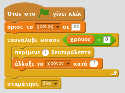
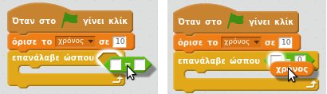

## Προσθέτοντας ένα χρονόμετρο

--- task ---

Δημιούργησε μία νέα μεταβλητή που ονομάζεται 'χρόνος'.

--- /task ---

--- task ---

Μπορείς να προσθέσεις ένα χρονόμετρο στο Σκηνικό σου για να δώσεις στον παίκτη σου μόνο 10 δευτερόλεπτα για να πιάσει όσα περισσότερα φαντάσματα μπορεί;

Το χρονόμετρό σου πρέπει να:

+ Ξεκινά από τα 10 δευτερόλεπτα
+ Μετρά κάθε δευτερόλεπτο

Το παιχνίδι πρέπει να σταματά όταν το χρονόμετρο φτάσει στο 0.

--- hints --- --- hint --- `Όταν πατηθεί η πράσινη σημαία`{:class="blockevents"}, η μεταβλητή σου `χρόνος`{:class="blockdata"} πρέπει να `οριστεί σε 10`{:class="blockdata"}. Στη συνέχεια πρέπει να `αλλάζει κατά -1`{:class="blockdata"} κάθε δευτερόλεπτο `έως ότου φτάσει στο 0`{:class="blockcontrol"}. --- /hint --- --- hint --- Εδώ είναι τα μπλοκ κώδικα που θα χρειαστείς:  --- /hint --- --- hint --- Να πως θα προσθέσεις το χρονόμετρο στο παιχνίδι σου: 

Και να πως θα δημιουργήσεις το μπλοκ `χρόνος = 0`:  --- /hint --- --- /hints ---

--- /task ---

--- task ---

Ζήτησε από έναν φίλο να δοκιμάσει το παιχνίδι σου. Πόσους πόντους μπορεί να κερδίσει;

--- /task ---

Αν το παιχνίδι σου είναι πολύ εύκολο, μπορείς να:

+ Δώσεις στον παίκτη λιγότερο χρόνο
+ Κάνεις τα φαντάσματα να εμφανίζονται λιγότερο συχνά
+ Κάνεις τα φαντάσματα μικρότερα

--- task ---

Άλλαξε και δοκίμασε το παιχνίδι σου μερικές φορές μέχρι να είσαι ευχαριστημένος ότι είναι το σωστό επίπεδο δυσκολίας.

--- /task ---