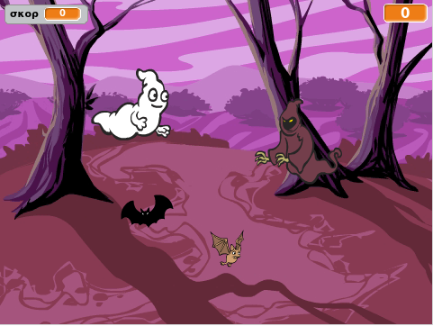

## Πρόκληση: περισσότερα αντικείμενα

Μπορείς να προσθέσεις άλλα αντικείμενα στο παιχνίδι σου;

Όταν προσθέτεις ένα αντικείμενο, πρέπει να σκεφτείς τα ακόλουθα πράγματα.

+ Πόσο μεγάλο είναι;
+ Θα φαίνεται λιγότερο ή περισσότερο συχνά από το φάντασμα;
+ Πως θα φαίνεται/ακούγεται όταν έχει πιαστεί;
+ Πόσους πόντους θα κερδίσει (ή χάσει) ο παίκτης για να το πιάσει;

Αν χρειάζεσαι βοήθεια για την προσθήκη άλλου αντικειμένου, μπορείς να επαναλάβεις τα παραπάνω βήματα!

***
### Κοινοτική συνεισφορά μετάφρασης 

Το έργο αυτό μεταφράστηκε από **Γιώργος Νικολαΐδης** και αναθεωρήθηκε από Βαγγέλης **Πορτιάς/Δήμητρα Θεοδώρου/Μάνος Ζεάκης**. 

Οι εκπληκτικοί μας εθελοντές-μεταφραστές μας βοηθούν να δώσουμε στα παιδιά όλου του κόσμου την ευκαιρία να μάθουν να προγραμματίζουν. Μπορείτε να μας βοηθήσετε να προσεγγίσουμε περισσότερα παιδιά μεταφράζοντας τα έργα μας - διαβάστε περισσότερα στο [rpf.io/translators](https://rpf.io/translators).
