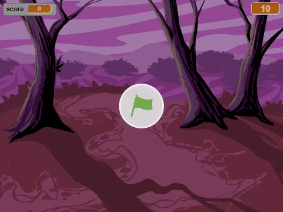

--- no-print ---

This is the **Scratch 2** version of the project. There is also a [Scratch 3 version of the project](https://projects.raspberrypi.org/en/projects/ghostbusters).

--- /no-print ---

## Introduction

You are going to make a ghost-catching game!

--- no-print ---

--- /no-print ---

--- print-only ---

--- /print-only ---

--- collapse ---

---
title: What you will need
---

### Hardware

+ A computer

### Software

+ Scratch 2.0 [offline](http://rpf.io/scratchoff){:target="_blank"}

--- /collapse ---

--- collapse ---

---
title: What you will learn
---

+ How to use random numbers to animate sprites
+ How to react to mouse clicks
+ How to create a timer

--- /collapse ---

--- collapse ---
---
title: Additional notes for educators
---

--- no-print ---

If you need to print this project, please use the [printer-friendly version](https://projects.raspberrypi.org/en/projects/ghostbusters-scratch2/print){:target="_blank"}.

--- /no-print ---

Find the [solution to this project here](http://rpf.io/p/en/ghostbusters-scratch2-get).

--- /collapse ---
