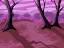
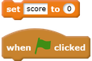
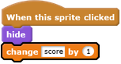

## Add a score

Now you're going to make your game more interesting by keeping score!

--- task ---

Create a new variable called `score`.

[[[generic-scratch-add-variable]]]

--- /task ---

--- task ---

Can you keep track of the player's score? Players should score points when they click on ghosts to catch them.

Each time a player clicks on a ghost, their score should increase.

--- hints ---
--- hint ---

`When the green flag is clicked`{:class="blockevents"}, your `score`{:class="blockdata"} variable should be `set to 0`{:class="blockdata"}. The Stage is the best place to add this code.

`When the ghost sprite is clicked`{:class="blockevents"}, the `score`{:class="blockdata"} variable should be `changed by 1`{:class="blockdata"}.

--- /hint ---
--- hint ---
Here are the code blocks you need:

--- /hint ---
--- hint ---

--- /hint ---
--- /hints ---

--- /task ---
