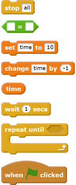
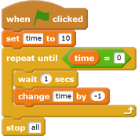

## Add a timer

Now you're going to add a timer so that the player only has ten seconds to catch as many ghosts as possible.

--- task ---

Create a new variable called 'time'.

--- /task ---

--- task ---

Can you add a timer to your Stage to give your player only 10 seconds to catch ghosts?

Your timer should:

+ Start at 10 seconds
+ Count down every second

The game should stop when the timer gets to 0.

--- hints ---
--- hint ---
`When the green flag is clicked`{:class="blockevents"}, your `time`{:class="blockdata"} variable should be `set to 10`{:class="blockdata"}. It should then `change by -1`{:class="blockdata"} every second `until it reaches 0`{:class="blockcontrol"}.
--- /hint ---
--- hint ---
Here are the code blocks you need to use:

--- /hint ---
--- hint ---
Here is the code you should add to create a timer:

--- /hint ---
--- /hints ---

--- /task ---

--- task ---

Ask a friend to test your game. How many points can they score?

--- /task ---

If your game is too easy, you can:

+ Give the player less time
+ Make the ghosts appear less often
+ Make the ghosts smaller

--- task ---

Change and test your game a few times until you're happy with its level of difficulty.

--- /task ---
