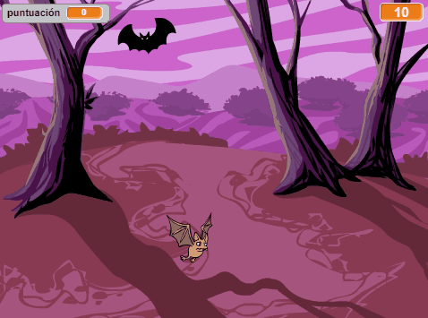
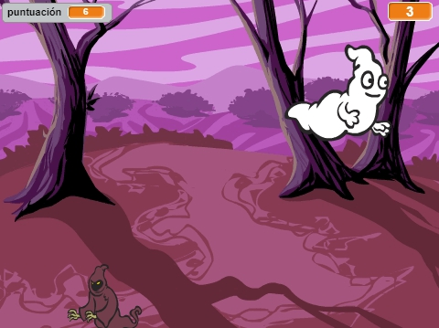

--- no-print ---

This is the **Scratch 2** version of the project. There is also a [Scratch 3 version of the project](https://projects.raspberrypi.org/es-ES/projects/ghostbusters).

--- /no-print ---

## Introducción

¡Vas a hacer un juego de atrapar fantasmas!

### Lo que harás

--- no-print ---

--- /no-print ---

--- print-only ---

--- /print-only ---

--- collapse ---
---
title: Lo que necesitarás
---
### Hardware

+ Un ordenador

### Software

+ Scratch 2.0 ([en línea](http://rpf.io/scratchon){:target="_blank"} o [sin conexión](http://rpf.io/scratchoff){:target="_blank"})

--- /collapse ---

--- collapse ---
---
title: Lo que aprenderás
---
Este proyecto incluye elementos de los siguientes aspectos del [currículo de creación digital de Raspberry Pi](http://rpf.io/curriculum){:target="_blank"}:

+ [Usar estructuras de programación básicas para crear programas simples.](https://www.raspberrypi.org/curriculum/programming/creator)

--- /collapse ---

--- no-print ---

Si necesitas imprimir este proyecto, usa la [versión para imprimir](https://projects.raspberrypi.org/es-ES/projects/ghostbusters-scratch2/print).

--- /no-print ---