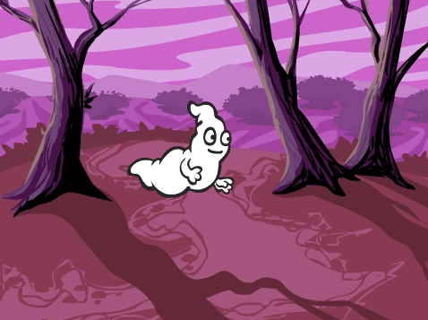
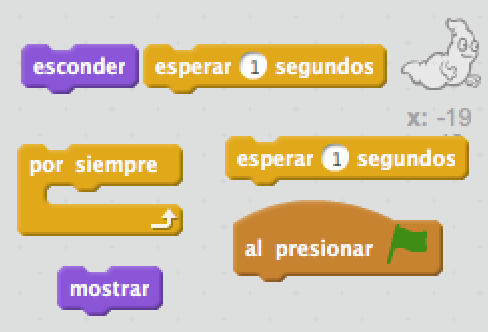
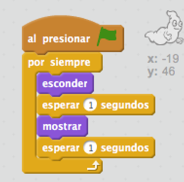

## Animando un fantasma

--- task ---

Abre un nuevo proyecto vacío de Scratch.

[[[generic-scratch-new-project]]]

--- /task ---

--- task ---

Añade una nueva figura de un fantasma y un fondo de escenario adecuado.

[[[generic-scratch-sprite-from-library]]]

[[[generic-scratch-backdrop-from-library]]]

--- /task ---

--- task ---

Añade código a tu fantasma para que aparezca y desaparezca continuamente después de que hagas clic en la bandera.

--- hints --- --- hint --- Una vez que `hagas clic en la bandera verde`{:class=”blockevents”}, tendrás que hacer que tu fantasma se `esconda`{:class=”blocklooks”} durante `un segundo`{:class=”blockcontrol”} y que después `se muestre`{:class=”blocklooks”} durante `un segundo`{:class=”blockcontrol”}. Tendrá que hacer esto `por siempre`{:class=”blockcontrol”}. --- /hint --- --- hint --- Estos son los bloques de código que necesitarás:  --- /hint --- --- hint --- Tu código debería quedar así:  --- /hint --- --- /hints ---

--- /task ---

--- task ---

Prueba y guarda tu proyecto.

[[[generic-scratch-saving]]]

--- /task ---