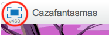
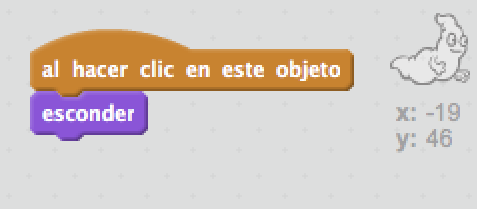

## Atrapando fantasmas

¡Permitamos que el jugador atrape fantasmas!

--- task ---

¿Puedes hacer que tu fantasma desaparezca cuando es atrapado?

Deberías poder hacer clic en los fantasmas para atraparlos. Si capturarlos te resulta difícil, puedes jugar al juego en modo de pantalla completa haciendo clic en este botón:

--- hints --- --- hint --- `Al hacer clic sobre él`{:class=”blockevents”}, tu fantasma se debería `esconder`{:class=”blocklooks”}. --- /hint --- --- hint --- Tu código debería quedar así:  --- /hint --- --- /hints ---

--- /task ---

--- challenge ---

## Desafío: añadir un sonido

¿Puedes conseguir que tu fantasma haga un sonido cada vez que es atrapado? --- /challenge ---