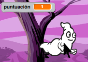
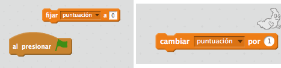
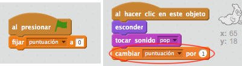

## Añadir una puntuación

¡Vamos a hacer las cosas más interesantes añadiendo una puntuación!

--- task ---

Crea una nueva variable llamada 'puntuación'.

[[[generic-scratch-add-variable]]]

--- /task ---

--- task ---

¿Puedes llevar la cuenta de la puntuación del jugador? Los jugadores deberían ganar puntos haciendo clic en los fantasmas para atraparlos.

Cada vez que un jugador hace clic en un fantasma, su puntuación debería aumentar.

--- hints --- --- hint --- `Cuando hagas click en la bandera verde`{:class=”blockevents”}, tu variable `puntuación`{:class=”blockdata”} debería `ponerse a 0`{:class=”blockdata”}. El escenario es el mejor lugar para añadir este código. `Cuando hagas click en la figura del fantasma`{:class=”blockevents”}, la `puntuación`{:class=”blockdata”} debería `incrementarse en 1`{:class=”blockdata”}. --- /hint --- --- hint --- Estos son los bloques de código que tendrás que usar:  --- /hint --- --- hint --- Aquí ves cómo se suman puntos haciendo clic en los fantasmas:  --- /hint --- --- /hints ---

--- /task ---