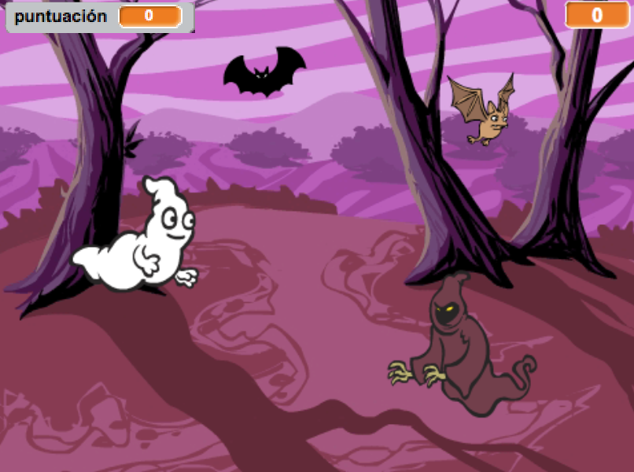

## Desafío: más objetos

¿Puedes añadir otros objetos a tu juego?

Cuando estás añadiendo un objeto, necesitas tener en cuenta lo siguiente:

+ ¿Cómo es de grande?
+ ¿Aparecerá con más o menos frecuencia que el fantasma?
+ ¿Qué aspecto tendrá y qué sonido hará cuando lo atrapen?
+ ¿Cuántos puntos ganará (o perderá) el jugador por atraparlo?

Si necesitas ayuda para añadir otro objeto ¡puedes reutilizar los pasos anteriores!

***
### Traducción aportada por la comunidad

Este proyecto fue traducido por Ellie Buckler/María Alejandra Aguada/Montse Verdaguer y revisado por Pablo Collado/Helmut Schlimper/Laura Lurati/Luis Javier Sanz.

Nuestros increíbles voluntarios de traducción nos ayudan a dar a los niños de todo el mundo la oportunidad de aprender a programar. Puedes ayudarnos a llegar a más niños traduciendo nuestros proyectos. Consigue más información en [rpf.io/translators](https://rpf.io/translators).

