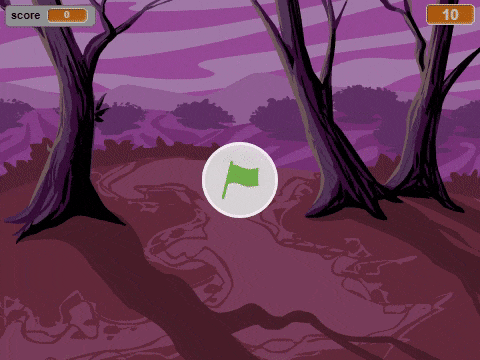

--- no-print ---

This is the **Scratch 2** version of the project. There is also a [Scratch 3 version of the project](https://projects.raspberrypi.org/fr-FR/projects/ghostbusters).

--- /no-print ---

## Introduction

Tu vas faire un jeu attrape-fantôme!

### Ce que tu feras

--- no-print ---

--- /no-print ---

--- print-only ---

--- /print-only ---

--- collapse ---
---
title: Ce qu'il faut avoir
---
### Matériel informatique

+ Un ordinateur

### Logiciels

+ Scratch 2.0 ( [en ligne](http://rpf.io/scratchon) ou [hors ligne](http://rpf.io/scratchoff)")

--- /collapse ---

--- collapse ---
---
title: Ce que tu vas apprendre
---
Ce projet couvre les éléments suivantes des sections du curriculum [ Raspberry Pi Digital Making](http://rpf.io/curriculum){:target="_blank"}:

+ [Utiliser les constructs basiques de programmation pour élaborer un programme simple.](https://www.raspberrypi.org/curriculum/programming/creator)

--- /collapse ---

--- no-print ---

Si vous avez besoin d'imprimer ce projet, merci d'utiliser la [Version imprimable](https://projects.raspberrypi.org/fr-FR/projects/ghostbusters-scratch2/print).

--- /no-print ---