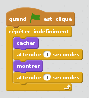

## Animer un fantôme

--- task ---

Ouvre un nouveau projet Scratch vide.

[[[generic-scratch-new-project]]]

--- /task ---

--- task ---

Ajoute un nouveau lutin fantôme et un arrière plan appropriée.

[[[generic-scratch-sprite-from-library]]]

[[[generic-scratch-backdrop-from-library]]]

--- /task ---

--- task ---

Ajoute du code à ton fantôme afin qu'il apparaisse et disparaisse indéfiniment quand tu cliques sur le drapeau.

--- hints --- --- hint --- Quand le `drapeau vert est cliqué`{:class=”blockevents”}, tu dois faire `disparaître`{:class=”blocklooks”} ton fantôme pendant `une seconde`{:class=”blockcontrol”} et ensuite le l'`afficher`{:class=”blocklooks”} pendant `une seconde`{:class=”blockcontrol”}. Il devra le faire `pour toujours`{:class="blockcontrol"}. --- /hint --- --- hint --- Voici les blocs de code dont tu auras besoin:  --- /hint --- --- hint --- Ton code devrait ressembler à ceci:  --- /hint --- --- /hints ---

--- /task ---

--- task ---

Teste et sauvegarde ton projet.

[[[generic-scratch-saving]]]

--- /task ---