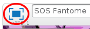
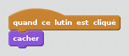

## Attraper des fantômes

Laissons le joueur attraper des fantômes!

--- task ---

Peux-tu cacher ton fantôme quand il a été attrapé?

Tu dois pouvoir cliquer sur les fantômes pour les attraper. Si tu le trouves difficile de les attraper, tu peux jouer au jeu en mode plein écran en cliquant sur ce bouton :

--- hints --- --- hint --- `Quand il est cliqué`{:class=”blockevents”}, ton fantôme doit se `cacher`{:class=”blocklooks”}. --- /hint --- --- hint --- Ton code devrait ressembler à ceci :  --- /hint --- --- /hints ---

--- /task ---

--- challenge ---

## Défi: ajouter un son

Peux-tu faire que ton fantôme joue un son chaque fois qu'il est attrapé ? --- /challenge ---