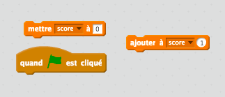
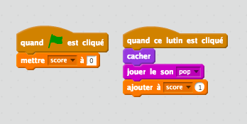

## Ajouter un score

Rendons les choses plus intéressantes en comptant les points !

--- task ---

Créez une nouvelle variable appelée « score ».

[[[generic-scratch-add-variable]]]

--- /task ---

--- task ---

Peux-tu garder le score du joueur ? Les joueurs doivent marquer des points en cliquant sur les fantômes pour les attraper.

Chaque fois qu'un joueur clique sur un fantôme, son score devrait augmenter.

--- hints --- --- hint --- `quand le drapeau vert est cliqué`{:class=”blockevents”}, ta variable `score`{:class=”blockdata”} doit `être définie sur 0`{:class=”blockdata”}. La scène est le meilleur endroit pour ajouter ce code. `Quand le lutin fantôme est cliqué`{:class=”blockevents”}, `ajouter à score 1`{:class=”blockdata”}. --- /hint --- --- hint --- Voici les blocs de code dont tu auras besoin:  --- /hint --- --- hint --- Ton code devrait ressembler à ceci:  --- /hint --- --- /hints ---

--- /task ---