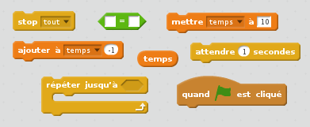
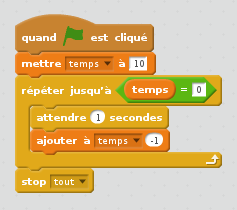
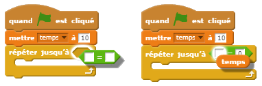

## Ajouter un chronomètre

--- task ---

Créer une nouvelle variable appelée « temps ».

--- /task ---

--- task ---

Peux-tu ajouter un chronomètre à ta scène pour donner ton joueur seulement 10 secondes pour attraper autant de fantômes que possible ?

Ton chronomètre devra :

+ Commencer à 10 secondes
+ Compter à rebours toutes les secondes

Le jeu devrait s'arrêter quand le chronomètre atteindra 0.

--- hints --- --- hint --- `quand le drapeau vert est cliqué`{:class=”blockevents”}, ta variable `temps`{:class=”blockdata”} doit `être définie sur 10`{:class=”blockdata”}. Il devra alors `ajouter -1`{:class=”blockdata”} chaque seconde `jusqu'à ce qu'il atteigne 0`{:class=”blockcontrol"}. --- /hint --- --- hint --- Voici les blocs de code dont tu auras besoin:  --- /hint --- --- hint --- Ton code devrait ressembler à ceci: 

Et voici comment créer le bloc de `temps = 0` :  --- /hint --- --- /hints ---

--- /task ---

--- task ---

Demande à un ami de tester ton jeu. Combien de points peuvent-t-il marquer ?

--- /task ---

Si ton jeu est trop facile, tu peux :

+ Donner au joueur moins de temps
+ Faire apparaître les fantômes moins souvent
+ Rendre les fantômes plus petits

--- task ---

Change et test ton jeu plusieurs fois jusqu'à ce que tu sois satisfait du niveau de difficulté.

--- /task ---