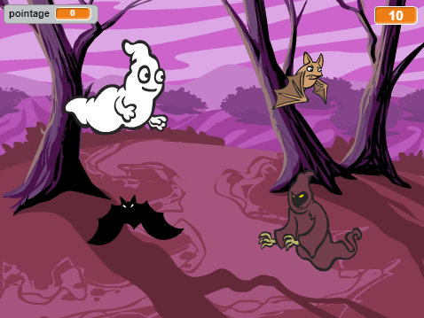

## Défi : plus d'objets

Peux-tu ajouter d'autres objets à ton jeu ?

Quand tu ajoutes un objet, tu dois penser aux éléments suivants.

+ Quelle est sa taille ?
+ Apparaîtra-t-il plus ou moins souvent que le fantôme ?
+ À quoi ressemblera-t-il / comment sonnera-t-il quand il sera attrapé ?
+ Combien de points va le joueur marquer (ou perdre) pour l'avoir attrapé ?

Si tu as besoin d'aide pour ajouter un autre objet, tu peux réutiliser les étapes en haute ici !

***
### Traduction de la communauté

Ce projet a été traduit par Josie Houg/David Debaire/Simon Gleises  et vérifié par Sarah-Jane Hubbard/Mohamed Ali Chelbi. 

Nos incroyables bénévoles de traduction nous aident à donner aux enfants du monde entier la chance d'apprendre à coder. Vous pouvez nous aider à atteindre plus d'enfants en traduisant nos projets - en savoir plus sur [rpf.io/translators](https://rpf.io/translators).
