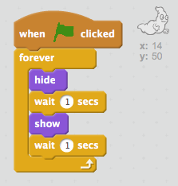

## भूत को एनिमेट करना

+ नया खाली Scratch प्रोजेक्ट खोलें।

[[[generic-scratch-new-project]]]

+ नया घोस्ट स्प्राइट और उचित स्टेज बैकड्रॉप जोड़ें।

	

[[[generic-scratch-sprite-from-library]]]

[[[generic-scratch-backdrop-from-library]]]

+ अपने भूत में कोड जोड़ें, ताकि जब आप फ्लैग पर क्लिक करें तो यह सदा दिखाई देता और गायब होता रहे। अपने प्रोजेक्ट का परीक्षण करें और सहेजें।

--- hints ---
--- hint ---
`⚑ क्लिक किया गया` होने पर, आपको अपना भूत `छुपाना` होगा, `एक सेकेंड` के लिए और फिर `दिखाना` होगा, `एक सेकेंड` के लिए। इसे ऐसा `हमेशा के लिए` के लिए ऐसा करना होगा।
--- /hint ---
--- hint ---
ये वे कोड ब्लॉक हैं, जिनकी आपको आवश्यकता होगी:

--- /hint ---
--- hint ---
आपका कोड इस प्रकार दिखाई देगा:

--- /hint ---
--- /hints ---

[[[generic-scratch-saving]]]
