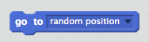

## बेतरतीब भूत

फ़िलहाल आपके भूत को पकड़ना बहुत आसान है, क्योंकि यह गति नहीं करता!

+ क्या आप अपने भूत में कोड जोड़ सकते हैं, ताकि एक ही स्थिति में रहने की बजाय, यह स्क्रीन पर बेतरतीब स्थानों पर दिखाई दे?

--- hints ---
--- hint ---
आप चाहते हैं कि स्क्रीन पर हर बार आपका भूत दिखाई देने से पहले, स्टेज पर `पर जाएँ` बेतरतीब स्थान पर।
--- /hint ---
--- hint ---
आप दो प्रकार के कोड ब्लॉक्स का उपयोग कर सकते हैं।
यह:

या यह:

--- /hint ---
--- hint ---
आपका कोड या तो कुछ इस तरह दिखना चाहिए:

या यह ऐसा दिख सकता है:

--- /hint ---
--- /hints ---

--- challenge ---
## चुनौती: और बेतरतीबी
क्या आप ऐसा कर सकते हैं कि आपका भूत दिखाई देने से पहले बेतरतीब समय तक `तक ठहरे`? क्या आप हर बार नए आकार का भूत बनाने के लिए `आकार सेट करें` ब्लॉक का उपयोग कर सकते हैं?
--- /challenge ---
