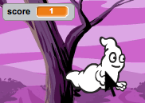
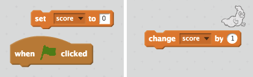

## स्कोर जोड़ना

चलिए स्कोर रखकर इसे और भी दिलचस्प बनाएँ!

+ 'स्कोर' नामक वेरिएबल बनाएँ।

[[[generic-scratch-add-variable]]]

+ क्या आप खिलाड़ी के स्कोर का ध्यान रख सकते हैं? स्कोर बनाने के खिलाड़ी को भूत पकड़ने के लिए उन पर क्लिक करना होगा।

     हर बार भूत पर क्लिक करने पर स्कोर बढ़ जाएगा।

    

--- hints ---
--- hint ---
`जब ⚑ क्लिक किया गया हो`, तो आपका `स्कोर` वेरिएबल `0 पर सेट करें` होना चाहिए। इस कोड को जोड़ने के लिए स्टेज सबसे बढ़िया स्थान है। `भूत स्प्राईट को क्लिक करने पर`, तो `स्कोर` `1 से बदल` जाना चाहिए।
--- /hint ---
--- hint ---
ये वे कोड ब्लॉक हैं, जिनकी आपको उपयोग के लिए आवश्यकता होगी:

--- /hint ---
--- hint ---
भूतों पर क्लिक करके स्कोर इस प्रकार बनाएं:

--- /hint ---
--- /hints ---
