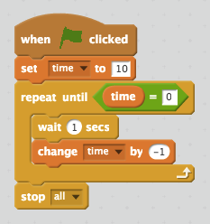

## टाइमर जोड़ना

+ 'समय' नामक नया वेरिएबल बनाएँ।

+ अपने खिलाड़ी को भूत पकड़ने के लिए अधिकतम 10 सेकंड का समय देने के लिए क्या आप अपनी स्टेज में टाइमर जोड़ सकते हैं?

	 आपके टाइमर को यह करना चाहिए:

	+ 10 सेकंड पर आरंभ हो
	+ हर सेकंड गिने
	
	टाइमर 0 होने पर गेम रुक जानी चाहिए।

--- hints ---
--- hint ---
`जब ⚑ क्लिक किया गया हो`, आपका `समय` वेरिएबल `10 पर सेट` किया जाना चाहिए। फिर इसे हर सेकंड `-1 से बदल` हो जाना चाहिए `जब तक यह 0 पर पहुँचे`।
--- /hint ---
--- hint ---
ये वे कोड ब्लॉक हैं, जिनकी आपको उपयोग के लिए आवश्यकता होगी:

--- /hint ---
--- hint ---
अपनी गेम में इस प्रकार टाइमर जोड़ें:

और इस प्रकार `समय = 0` ब्लॉक बनाएँ:

--- /hint ---
--- /hints ---

+ अपनी गेम का परीक्षण करने के लिए अपने मित्र से कहिए। वे कितने पॉइंट्स हासिल कर पाते हैं?
	
	यदि आपकी गेम बहुत आसान है, तो आप यह कर सकते हैं:

	+ खिलाड़ी को कम समय देना
	+ भूत कम बार दिखाई देना
	+ भूत को छोटा करना

	गेम में तब तक परिवर्तन करें और परीक्षण करें जब तक आप इसकी कठिनता के स्तर से ख़ुश न हो जाएँ।
