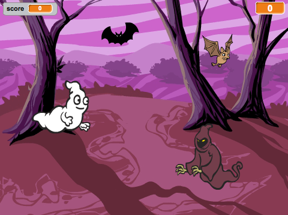

  [ऑफ़लाइन पूर्ण प्रोजेक्ट](resources/Ghostbusters-Finished.sb2){:download='Ghostbusters-Finished.sb2'}
  [ऑनलाइन पूर्ण प्रोजेक्ट](http://scratch.mit.edu/projects/60787262/#editor){:target="_blank"}

--- challenge ---

## चुनौती: और ऑब्जेक्ट

क्या आप अपनी गेम में अन्य ऑब्जेक्ट्स जोड़ सकते हैं?

जब आप ऑब्जेक्ट जोड़ते हैं, तो आपको निम्नलिखित बातों पर ध्यान देना होगा।

+ यह कितना बड़ा है?
+ क्या यह भूत से कम या अधिक बार दिखाई देगा?
+ पकड़े जाने पर यह कैसा दिखाई देगा/कैसी आवाज़ करेगा?
+ इसे पकड़ने पर खिलाड़ी को कितने अंक मिलेंगे (या कम होंगे)?

यदि अन्य ऑब्जेक्ट को जोड़ने में आपको सहायता की आवश्यकता हो, तो आप उपर्युक्त चरणों का पुनः उपयोग कर सकते हैं!

--- /challenge ---
