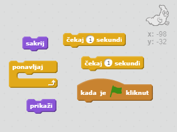
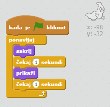

## Animacija duha

--- task ---

Započni novi Scratch projekt.

[[[generic-scratch-new-project]]]

--- /task ---

--- task ---

Dodaj novog lika duha i prikladnu pozadinu.

[[[generic-scratch-sprite-from-library]]]

[[[generic-scratch-backdrop-from-library]]]

--- /task ---

--- task ---

Dodaj sljedeće naredbe liku duha tako da se on neprestano pojavljuje i nestaje kada klikneš na zelenu zastavicu.

--- hints --- --- hint --- Kada je `zelena zastavica kliknuta`{:class="blockevents"}, tvoj duh se mora `sakriti`{:class="blocklooks"} na `jednu sekundu`{:class="blockcontrol"}, a zatim ponovno `pojaviti`{:class="blocklooks"} na `jednu sekundu`{:class="blockcontrol"}. To mora ponavljati `neprestano`{:class="blockcontrol"}. --- /hint --- --- hint --- Trebat ćeš sljedeće blokove naredbi:  --- /hint --- --- hint --- Ovako bi tvoj kôd trebao izgledati:  --- /hint --- --- /hints ---

--- /task ---

--- task ---

Testiraj i spremi svoj projekt.

[[[generic-scratch-saving]]]

--- /task ---