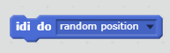
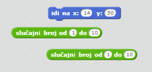
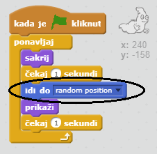
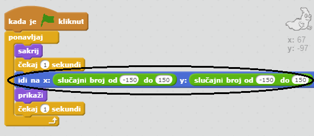

## Duh se pojavljuje na nasumičnim mjestima

Ovog duha je jako lako uhvatiti jer je nepomičan!

--- task ---

Možeš li dodati kôd svom duhu tako da se pojavljuje na nasumičnim mjestima na ekranu umjesto da stoji na istom mjestu?

--- hints --- --- hint --- Želiš da tvoj duh `ide na`{:class="blockmotion"} nasumično mjesto na pozornici prije svakog pojavljivanja. --- /hint --- --- hint --- Postoje dva bloka naredbi koje možeš koristiti. Ovaj:  Ili ovaj:  --- /hint --- --- hint --- Tvoj kôd bi trebao izgledati ovako:  Ili ovako:  --- /hint --- --- /hints ---

--- /task ---

--- challenge ---

## Izazov: više nasumičnosti

Možeš li napraviti promjene u naredbi `čekaj`{:class="blockcontrol"} tako da duh čeka neko vrijeme prije nego što se pojavi? Možeš li koristiti naredbu `postavi veličinu`{:class="blocklooks"} tako da duh bude različite veličine svaki put kad se pojavi? --- /challenge ---