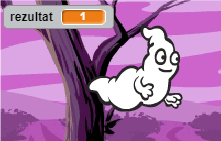
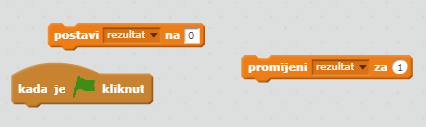
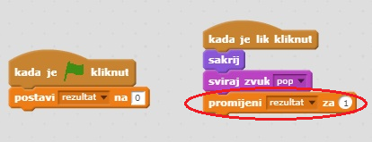

## Dodavanje rezultata

Napravimo igru zanimljivijom tako što ćemo dodati rezultat!

--- task ---

Stvori novu varijablu 'rezultat'.

[[[generic-scratch-add-variable]]]

--- /task ---

--- task ---

Možeš li pratiti igračev rezultat? Igrači dobivaju bodove kada kliknu na duhove i uhvate ih.

Svaki put kad igrač klikne na duha, njegov rezultat se treba povećati.

--- hints --- --- hint --- `Kada je zelena zastavica kliknuta`{:class="blockevents"}, varijabla `rezultat`{:class="blockdata"} mora biti `postavljena na 0`{:class="blockdata"}. Pozornica je najbolje mjesto za dodavanje ovog kôda. `Svaki puta kada je duh uhvaćen`{:class="blockevents"}, `rezultat`{:class="blockdata"} se treba `povećati za jedan bod`{:class="blockdata"}. --- /hint --- --- hint --- Trebaš koristiti sljedeće blokove naredbi:  --- /hint --- --- hint --- Na ovaj način ćeš dobiti bodove klikanjem na duhove:  --- /hint --- --- /hints ---

--- /task ---