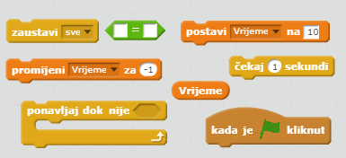
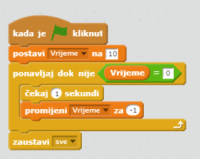
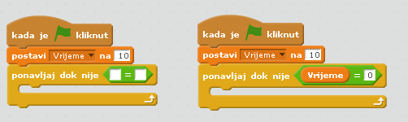

## Dodavanje mjerača vremena

--- task ---

Napravi novu varijablu 'vrijeme'.

--- /task ---

--- task ---

Možeš li na Pozornicu dodati mjerač vremena kako bi igrač imao samo 10 sekundi da uhvati što je više moguće duhova?

Želimo napraviti sljedeće:

+ Početno vrijeme neka bude na 10 sekundi
+ Preostalo vrijeme smanjuje se svake sekunde

Igra prestaje kada vrijeme dođe do 0.

--- hints --- --- hint --- `Kada je zelena zastavica kliknuta`{:class="blockevents"}, varijabla `vrijeme`{:class="blockdata"} mora biti `postavljena na 10`{:class="blockdata"}. Zatim se mora `promijeniti za -1`{:class="blockdata"} svake sekunde `sve dok ne dođe do nule`{:class="blockcontrol"}. --- /hint --- --- hint --- Trebat ćeš sljedeće blokove naredbi:  --- /hint --- --- hint --- Ovako ćeš dodati mjerač vremena: 

A ovako ćeš dodati `vrijeme = 0` kôd:  --- /hint --- --- /hints ---

--- /task ---

--- task ---

Zamoli prijatelja da isproba tvoju igru. Koliko bodova može osvojiti?

--- /task ---

Ako ti se igra čini prejednostavna možeš:

+ Dati igraču manje vremena
+ Napraviti da se duhovi ne pojavljuju tako često
+ Smanjiti duhove

--- task ---

Isprobaj igru nekoliko puta i doradi je sve dok ne bude dovoljno teška.

--- /task ---