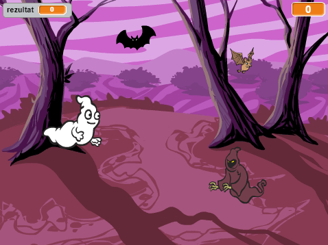

## Izazov: više objekata

Možeš li dodati više objekata u igru?

Kada dodaješ objekt, moraš razmisliti o sljedećem.

+ Koliko je objekt velik?
+ Hoće li se pojavljivati češće nego duhovi?
+ Kako će izgledati/zvučati kada je uhvaćen?
+ Koliko bodova će igrač dobiti (ili izgubiti) kada bude uhvaćen?

Trebaš li pomoć oko dodavanja drugih objekata, ponovi korake iznad!

***
### Prijevod članova zajednice 

Ovaj je projekt preveo/la **Maja Manojlović** i pregledao/la **Erik Braun**. 

Naši nevjerojatni volonteri prevoditelji pomažu nam da djeci širom svijeta pružimo priliku da nauče programirati. Možete nam pomoći da dosegnemo više djece prevođenjem naših projekata - pročitajte više na [rpf.io/translators](https://rpf.io/translators).
