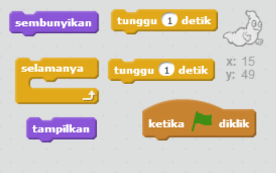
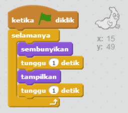

## Menganimasikan satu hantu

--- task ---

Buka proyek Scratch kosong baru.

[[[generic-scratch-new-project]]]

--- /task ---

--- task ---

Tambahkan sprite hantu baru dan latar belakang Stage yang sesuai.

[[[generic-scratch-sprite-from-library]]]

[[[generic-scratch-backdrop-from-library]]]

--- /task ---

--- task ---

Tambahkan kode untuk menampilkan dan menyembunyikan hantu kamu terus-menerus saat kamu meng-klik bendera.

--- hints --- --- hint --- Saat `bendera hijau diklik`{:class="blockevents"}, kamu harus membuat hantu kamu `sembunyi`{:class="blocklooks"} selama `satu detik`{:class=”blockcontrol”} dan kemudian `tampil`{:class="blocklooks"} selama `satu detik`{:class="blockcontrol"}. Hantu perlu melakukan ini `selamanya`{:class="blockcontrol"}. --- /hint --- --- hint --- Berikut adalah blok kode yang kamu perlukan:  --- /hint --- --- hint --- Berikut adalah tampilan seharusnya dari kode kamu:  --- /hint --- --- /hints ---

--- /task ---

--- task ---

Uji dan simpan proyek kamu.

[[[generic-scratch-saving]]]

--- /task ---