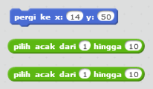
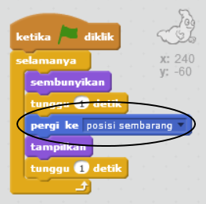
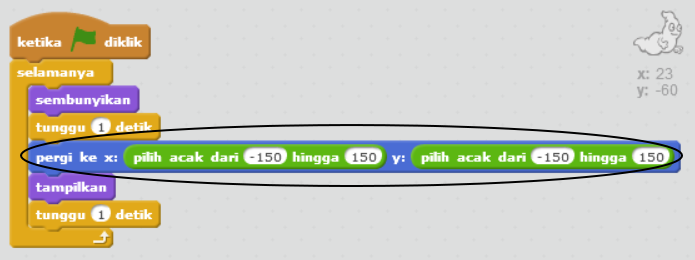

## Hantu acak

Hantu kamu sangat mudah ditangkap saat ini, karena dia tidak bergerak!

--- task ---

Dapatkah kamu tambahkan kode ke hantu kamu sehingga, alih-alih diam di tempat, hantu muncul pada posisi acak di layar?

--- hints --- --- hint --- Kamu mau hantu kamu untuk `pergi ke`{:class="blockmotion"} posisi acak di atas panggung setiap kali sebelum muncul. --- /hint --- --- hint --- Ada dua set blok kode yang dapat kamu gunakan. Yang ini:  Atau yang ini:  --- /hint --- --- hint --- Kode kamu seharusnya terlihat seperti ini:  Atau dapat terlihat seperti ini:  --- /hint --- --- /hints ---

--- /task ---

--- challenge ---

## Tantangan: perilaku acak tambahan

Dapatkah kamu membuat hantu kamu `menunggu`{:class="blockcontrol"} beberapa saat secara acak sebelum tampil? Dapatkah kamu menggunakan blok `atur ukuran`{:class="blocklooks"} untuk membuat hantu kamu berukuran acak setiap kali dia tampil? --- /challenge ---