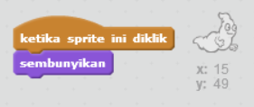

## Menangkap hantu

Mari kita biarkan pemain menangkap hantu!

--- task ---

Dapatkah kamu membuat hantu kamu lenyap ketika dia tertangkap?

Kamu seharusnya mampu mengklik hantu untuk menangkap mereka. Jika kamu kesulitan dalam menangkap, kamu dapat memainkan game dalam mode layar-penuh dengan mengklik tombol ini:

--- hints --- --- hint --- `Ketika diklik`{:class=”blockevents”}, sprite hantu kamu harus `sembunyi`{:class=”blocklooks”}. --- /hint --- --- hint --- Kode kamu seharusnya terlihat seperti ini:  --- /hint --- --- /hints ---

--- /task ---

--- challenge ---

## Tantangan: menambahkan suara

Dapatkah kamu membuat hantu kamu bersuara setiap kali dia tertangkap? --- /challenge ---