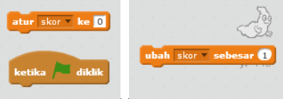
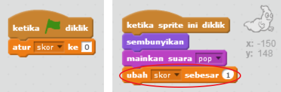

## Menambahkan skor

Mari kita jadikan game lebih menarik dengan mencatat skor!

--- task ---

Buat variabel baru bernama 'skor'.

[[[generic-scratch-add-variable]]]

--- /task ---

--- task ---

Dapatkah kamu mencatat skor pemain? Pemain harus mencetak poin dengan mengklik hantu untuk menangkap mereka.

Setiap kali pemain mengklik hantu, skor mereka harus meningkat.

--- hints --- --- hint --- `Ketika bendera hijau diklik`{:class=”blockevents”}, variabel `skor`{:class=”blockdata”} kamu harus di-`atur ke 0`{:class=”blockdata”}. Stage adalah tempat terbaik untuk menambahkan kode ini. `Ketika sprite hantu diklik`{:class=”blockevents”}, `skor`{:class=”blockdata”} harus di-`ubah sebesar 1`{:class=”blockdata”}. --- /hint --- --- hint --- Berikut adalah blok kode yang kamu perlu gunakan:  --- /hint --- --- hint --- Berikut cara mencetak poin dengan mengklik hantu:  --- /hint --- --- /hints ---

--- /task ---