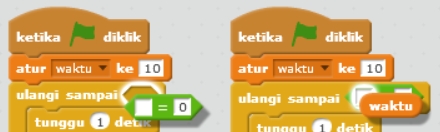

## Menambahkan pengatur waktu

--- task ---

Buat variabel baru bernama 'waktu'.

--- /task ---

--- task ---

Dapatkah kamu menambahkan pengatur waktu ke Stage untuk memberi hanya 10 detik bagi pemain untuk menangkap hantu sebanyak mungkin?

Pengatur waktu kamu harus:

+ Mulai dari 10 detik
+ Menghitung mundur setiap detik

Game harus berhenti saat pengatur waktu menjadi 0.

--- hints --- --- hint --- `Ketika bendera hijau diklik`{:class=”blockevents”}, variable `waktu`{:class=”blockdata”} kamu harus di-`atur ke 10`{:class=”blockdata”}. Nilai ini harus di-`ubah sebesar -1`{:class=”blockdata”} setiap detik `sampai nilai menjadi 0`{:class=”blockcontrol"}. --- /hint --- --- hint --- Berikut adalah blok kode yang kamu perlu gunakan:  --- /hint --- --- hint --- Berikut cara menambahkan pengatur waktu ke game kamu: 

Dan berikut adalah cara membuat blok `time = 0`:  --- /hint --- --- /hints ---

--- /task ---

--- task ---

Mintalah seorang teman untuk menguji game Anda. Berapa banyak poin yang bisa mereka cetak?

--- /task ---

Jika game kamu terlalu mudah, kamu dapat:

+ Berikan pemain pengurangan waktu
+ Membuat hantu lebih jarang muncul
+ Buatlah hantu lebih kecil

--- task ---

Ubah dan uji permainan beberapa kali sampai kamu senang dengan tingkat kesulitan yang tepat.

--- /task ---